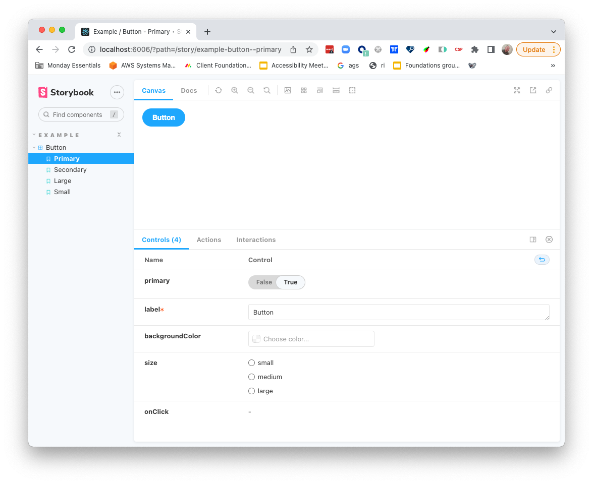

#Workshop 11 - Scaling UI Development
***
In order to create more isolated core components we will focus this workshop on creating our very own core library.
We will do so with the help of [Storybook](https://storybook.js.org/).
We want to focus on building isolated components with good and consistent props.

We will create the following components
1. [Avatar component](https://www.figma.com/file/rEZBYBTa8dJyjHthW4jETo/Avatar-(Copy)) - Is a graphical representation of a person through a profile picture, image, icon, or set of initials.
2. [Loader component](https://www.figma.com/file/o0iwQJFTX0ytpNhTYj4nEi/Circular-loader-(Copy)?node-id=0%3A1) - Circular loader indicates to user waiting state.
3. [Toggle component](https://www.figma.com/file/ho4Fo3Mt9OsUkSV96MKFNx/Toggle-(Copy)?node-id=0%3A1) - Allow users to turn an single option on or off. They are usually used to activate or deactivate a specific setting.
4. [Accordion component](https://www.figma.com/file/v64wRtyGvN1IKmaE3eYArd/Accordion-(Copy)?node-id=0%3A1) - Accordion is a vertically stacked list of items. Each item can be "expanded" or "collapsed" to reveal the content within with that item.

## Repo content
This repo is based on the default [React Create App](https://reactjs.org/docs/create-a-new-react-app.html) and the default storybook configuration for that app.

###This repo contains:
1. default react create app setup.
2. Button story for reference.

## Getting started
In order to run & start developing in your own storybook environment do the following
```bash
npm i
```
once the `npm` installation finishes please run 
```bash
npm run storybbok
```

You should get this tab to open on chrome


## Instructions
You need to implement at least **two core components** and create stories according to the figma.
Each link for each component points to a design given to you by our designers.
It will show you all of the required states and behaviours

### General guidelines
1. Take your time going over the figma
2. Try to use the same naming convention in your prop - i.e `size` vs `sizes` or `disabled` vs `isDisabled`
3. Before implementing your own component, play around with the example and storybook (especially the controls tab).

### Avatar component
The avatar component ss a graphical representation of a person through a profile picture, image, icon, or set of initials.

The required stories are:

***Shapes*** - the Avatar has two shapes, pay attention to the details

***Sizes*** - The Avatar has three different sizes, pay attention to inner paddings

***Content*** - The Avatar can show three different content types
1. Pictures - think about what sort of prop you should pass
2. Letters - think about how would you like the user to pass the information, maybe think about future improvements that might be needed
3. Icon - Think about how you want to present this icon, and is it really different from the other types

***Disabled*** - The Avatar component can be in a disabled mode


### Loader component
The Circular loader indicates to user waiting state.

Use this [Loader example](https://codepen.io/orrgottl/pen/JjpVvNB) - as a reference, notice that this is a pure html/css implementation to the loader, so some React tweaks.

The require stories are:
***Sizes*** - The loader has 4 different sizes.

***States*** - The loader has 4 different states - the stoke color.

***Variant*** - It has two different mode - with background and without background.

### Toggle
Allow users to turn an single option on or off. They are usually used to activate or deactivate a specific setting.

####Implementation
The toggle is based on `<input type="checkbox" />` element. Use this [codepen](https://codepen.io/orrgottl/pen/BaYExrj) as a reference
.
Pay attention to the `HTML` structure - it is very important.

Think about the props which are given ti the component and how do we want to "inform" the consumer that the state has changed.


The required stories are:

***States*** - on/off states.

***Disable*** - a disabled mode.

## Accordion
Accordion is a vertically stacked list of items. Each item can be "expanded" or "collapsed" to reveal the content within with that item.

####Implementation
This is the most complex component of the workshop, the component can be controlled via the props but it must keep a local state,
 think about how do you want to design your API, what is mandatory to pass in order for the component to function as intended 


The required stories are:

***Single Active*** - In this story, one and only one item can be expanded, the story should reflect this situation (it should be the default situation) 

***Multi Active*** - In this story and number of items can be extended.

***Header Title*** - In this story you want to show the consumer how they can change the header content


## Additional information
You've been given our monday.com color palette, in order to use them in your code you should do something like the following example for using primary text color
```css
.my-classname {
 color: var(--primary-text-color);
}
```
you can see usage example in `Button.css` 

